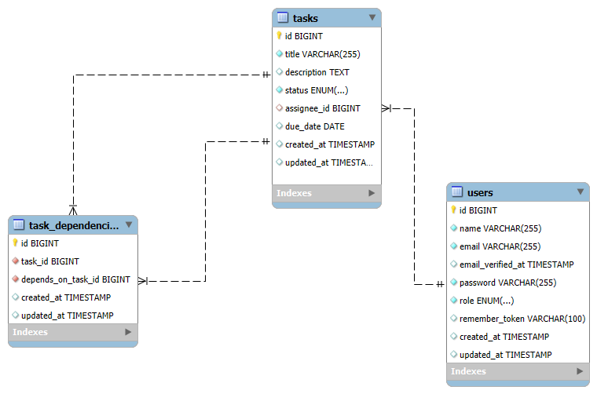

# Task Management System API

## Overview

This is a RESTful API for managing tasks within a task management system.  
The system supports user authentication, role-based access, task creation, task dependencies, and advanced filtering.

> ✅ Developed with Laravel and follows the Repository Pattern.  
> 🚫 **Docker is not included in this version.**

---

## Features

- User Authentication (JWT-based for seeded users).
- Create / Update tasks.
- Assign tasks to users (by managers).
- Add dependencies between tasks.
- Prevent task completion until all dependencies are completed.
- Filter tasks by:
  - Status
  - Due date range
  - Assigned user
- Role-based authorization:
  - **Managers** can create/update/assign tasks.
  - **Users** can retrieve only tasks assigned to them and update their status.

---

## Technologies Used

- Laravel 12
- MySQL
- JWT Authentication (`tymon/jwt-auth`)
- Repository Design Pattern
- L5-Swagger (API Documentation)
- Postman Collection
- PHP 8.1+

---

## Installation & Setup (Without Docker)

### 1. Clone the Repository

```bash
git clone https://github.com/your-username/task-management-api.git
cd task-management-api
```

### 2. Install Dependencies

```bash
composer install
```

### 3. Configure Environment

```bash
cp .env.example .env
```

Then set the following in your `.env` file:

- `DB_DATABASE`
- `DB_USERNAME`
- `DB_PASSWORD`

And generate JWT secret:

```bash
php artisan jwt:secret
```

### 4. Generate Application Key

```bash
php artisan key:generate
```

### 5. Run Migrations and Seeders

```bash
php artisan migrate --seed
```

### 6. Serve the Application

```bash
php artisan serve
```

---

## API Documentation

Swagger documentation is available at:

```
http://localhost:8000/api/documentation
```

---

## Postman Collection

A complete Postman collection and environment file are included in the repo under:

- `/postman/TaskManagementSystem.postman_collection.json`
- `/postman/TaskManagementEnv.postman.json`

---

## Database ERD Diagram



---

## Notes

- This version does **not include Docker** support.
- Make sure MySQL is running and matches your `.env` configuration.
- Seeded users include both **manager** and **regular user** roles for testing.
- Use the Swagger docs or Postman to explore the API.

---

## License

This project is developed for Softxpert Inc. assessment purposes.